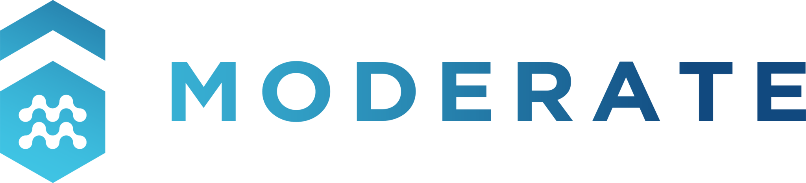

<p align="center">
  
</p>

# 🧱 BrickLLM App

BrickLLM is a web app for generating RDF files following the BrickSchema ontology using Large Language Models (LLMs). It is based on the python library BrickLLM - [pypi](https://pypi.org/project/brickllm/) and [github](https://github.com/EURAC-EEBgroup/brick-llm)

## 📝 Citation
Please cite us if you use:

- the library

[](https://zenodo.org/doi/10.5281/zenodo.14039358)

- the application

[](https://zenodo.org/doi/10.5281/zenodo.14039609)

# Brief description
The open-source python web app has been developed using [Dash plotly](https://dash.plotly.com/) and the [dash mantine components](https://www.dash-mantine-components.com/). The tool can be used:

  - directly through the website hosted by [Eurac Reserch](https://https://www.eurac.edu/en/institutes-centers/institute-for-renewable-energy/research-group/energy-efficient-buildings/) at the following link
  - on-premises.

## On-premises
It is recommended to use a virtual environment such as Pipenv or Pyenv. For example: 

``` bash
    pipenv shell --python 3.12.6
    pipenv install
    source $(pipenv --venv)/bin/activate
```

The tool is currently tested with Python 3.12.6. After installing the required libraries using the command 

``` bash
pip install -r requirements.txt
```

the application can start 
1) locally: running the command inside the folder BrickApp

``` bash
python app.py
```
the actual port set up is: 8091

or create and use a docker container:

1. build dev docker image: 
``` bash 
    docker build --platform=linux/amd64 -t brick:dev .   
```

2. run docker compose: 
``` bash 
    docker compose up
```

# Example

### Possible issue running in Mac:

If there are these allerts
``` bash 
objc[9558]: +[NSString initialize] may have been in progress in another thread when fork() was called.
objc[9558]: +[NSString initialize] may have been in progress in another thread when fork() was called. We cannot safely call it or ignore it in the fork() child process. Crashing instead. Set a breakpoint on objc_initializeAfterForkError to debug.
```

run in terminal:
``` bash
    export OBJC_DISABLE_INITIALIZE_FORK_SAFETY=YES
```

## 🤝 Contributing

We welcome contributions to BrickLLM! Please see our [contributing guidelines](CONTRIBUTING.md) for more information.

## 📜 License

BrickLLM is released under the BSD-3-Clause License. See the [LICENSE](LICENSE) file for details.

## 🫂 Contacts

For any questions or support, please contact:

- Daniele Antonucci <daniele.antonucci@eurac.edu>
- Olga Somova <olga.somova@eurac.edu>
- Marco Perini <marco.perini@eurac.edu>
- Rocco Giudice <rocco.giudice@polito.it>

## 💙 Acknowledgements
This work was carried out within European projects: 

<p align="center">
  
</p>

Moderate - Horizon Europe research and innovation programme under grant agreement No 101069834, with the aim of contributing to the development of open products useful for defining plausible scenarios for the decarbonization of the built environment

-----------------------------
Thank you to [**BrickSchema**](https://brickschema.org/) for the great work it is doing

